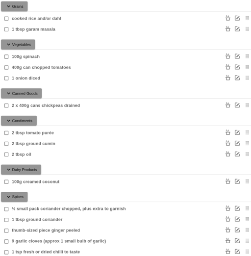

# 🥘 MealieAT - Automatic Tagging for Mealie Shopping Lists

**MealieAT** is a utility that automatically tags shopping list items from [Mealie](https://github.com/mealie-recipes/mealie) using a word similarity approach for the labels created in mealie. 

Example created using MealieAT:
<p align="center">
  
</p>

The project communicates with Mealie via its API, uses word embeddings to determine similarity between list item and label, and is deployed in a Docker container for easy setup.

---

## 🚀 Features

* 🔗 **Mealie API Integration**
  Fetches shopping list items directly from your Mealie instance. Use Mealie just as you normally would!

* 🧠 **Word Embedding Similarity**
  Uses word embeddings to semantically match shopping items to their most likely label.

* 💾 **Stores User overrides**
  Stores the labels that are manually assigned and re-applies the stored label in the future. 

* 📦 **Auto-Categorization**
  Automatically applies labels based on your predefined category list.

* 🐳 **Dockerized**
  Easy to run and deploy in any environment using Docker.

---

## 🛠️ Installation

### Prerequisites

* Docker
* A running instance of Mealie (v2)
* Mealie instance should have a set of labels configured. _You can manage labels by going to profile -> manage data -> (change orange dropdown to Labels)_
* A valid mealie API token _You can create one in mealie by going to profile -> API Tokens_

### Run with Docker

```bash
docker run -p 8081:8081 --env-file ./.env cm226/mealie-auto-tagger:0.2.0
```

---

## ⚙️ Environment Variables

| Variable               | Description                                | Required |
| ---------------------- | ------------------------------------------ | -------- |
| `host`                 | Url Mealie can use to reach mealieAT       | ✅        |
| `mealie_url`           | The URL mealieAT can use to reach mealie   | ✅        |
| `mealie_api_token`     | API Token to use with mealie               | ✅        |

checkout example [.env](./mealie-auto-tagger/src/.env)

---

## 📌 TODO / Roadmap

* Look at reducing the image size
* Train a better model

---

## 🎯 Accuracy

Dataset used for evaluation : https://huggingface.co/datasets/Scuccorese/food-ingredients-dataset

Randomly sampled 100 cases

Accuracy = correct / total

[Current results](./mealie-auto-tagger/modelResults.md)

---

## 🤝 Contributing

Contributions, issues, and feature requests are welcome! Feel free to fork the repo and submit a PR.

---

## ❤️ Acknowledgements

* [Mealie](https://github.com/mealie-recipes/mealie)

---
